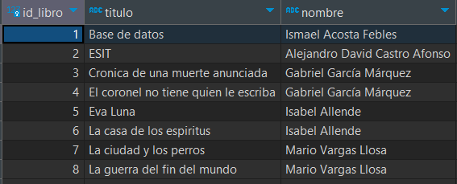
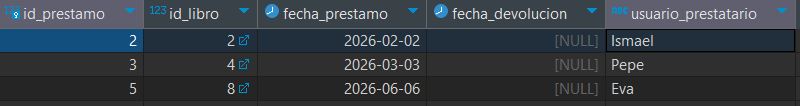
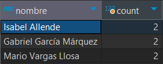
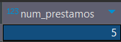
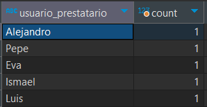
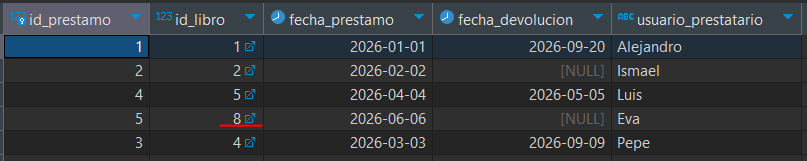
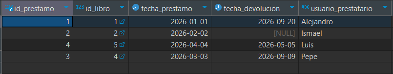

# P01_ADBD_Conceptos fundamentales de PostgreSQL.

Realizado por:
- Alejandro David Castro afonso ( alu0101327907@ull.edu.es )
- Ismael Acosta Febles ( alu0101323589@ull.edu.es )


## 1. Creación de la base de datos "biblioteca"
##### Comando
```sql
CREATE DATABASE biblioteca;
```
###### Salida 
```text
CREATE DATABASE
```

## 2. Creación de usuarios:
a. Crear dos usuario:
- admin_biblio con permisos de administrador sobre la base de datos.
```sql
CREATE USER admin_biblio WITH PASSWORD 'admin1234';
GRANT ALL PRIVILEGES ON DATABASE biblioteca TO admin_biblio;
ALTER DATABASE biblioteca OWNER TO admin_biblio;
```
- usuario_biblio.
```sql
CREATE USER usuario_biblio WITH PASSWORD 'usuario1234';
```
b. Crear un rol llamado lectores con permisos únicamente de consulta sobre las tablas de la base de datos.
```sql
CREATE ROLE lectores;
GRANT SELECT ON ALL TABLES IN SCHEMA public TO lectores;
```
c. Asignar el usuario usuario_biblio a este rol.
```sql
GRANT lectores TO usuario_biblio;
```
d. Consultar las tablas del sistema para listar todos los usuarios creados (pg_roles).
```sql
SELECT rolname FROM pg_roles;
```
###### Salida:
```text
           rolname           
-----------------------------
 pg_database_owner
 pg_read_all_data
 pg_write_all_data
 pg_monitor
 pg_read_all_settings
 pg_read_all_stats
 pg_stat_scan_tables
 pg_read_server_files
 pg_write_server_files
 pg_execute_server_program
 pg_signal_backend
 pg_checkpoint
 pg_use_reserved_connections
 pg_create_subscription
 postgres
 mydb_admin
 admin_biblio
 usuario_biblio
 lectores
(19 rows)
```
e. Cambiar la contraseña del usuario usuario_biblio.
```sql
ALTER USER usuario_biblio WITH PASSWORD '1234';
```
f. Configurar permisos de tal forma que el usuario usuario_biblio no pueda eliminar registros en ninguna tabla.
```sql
REVOKE DELETE ON ALL TABLES IN SCHEMA public FROM usuario_biblio;
```
## 3. Creación de tablas.
a. Crear las siguientes tablas con sus respectivas claves primarias y foráneas.
  i. autores:
  ```sql
  CREATE TABLE autores (
    id_autor SERIAL PRIMARY KEY,
    nombre VARCHAR(100) NOT NULL,
    nacionalidad VARCHAR(50)
  );
  ```
  ii. libros:
  ```sql
  CREATE TABLE libros (
    id_libro SERIAL PRIMARY KEY,
    titulo VARCHAR(200) NOT NULL,
    ano_publicacion INT,
    id_autor INT,
    FOREIGN KEY (id_autor)
      REFERENCES autores(id_autor)
      ON DELETE CASCADE
  );
  ```
iii. prestamos:
  ```sql
  CREATE TABLE prestamos (
    id_prestamo SERIAL PRIMARY KEY,
    id_libro INT,
    fecha_prestamo DATE NOT NULL,
    fecha_devolucion DATE,
    usuario_prestatario VARCHAR(100),
    FOREIGN KEY (id_libro)
      REFERENCES libros(id_libro)
      ON DELETE CASCADE
  );
  ```
## 4. Inserción de datos.
Insertar al menos 5 autores, 8 libros y 5 préstamos de ejemplo.
- 5 autores:
  ```sql
  INSERT INTO autores (nombre, nacionalidad) VALUES
  ('Ismael Acosta Febles', 'Español'),
  ('Alejandro David Castro Afonso', 'Español'),
  ('Gabriel García Márquez', 'Colombia'),
  ('Isabel Allende', 'Chile'),
  ('Mario Vargas Llosa', 'Peru');
  ```
  Comprobación: 
  ```text
   select * from autores;
   id_autor |            nombre             | nacionalidad 
  ----------+-------------------------------+--------------
        1 | Ismael Acosta Febles          | Español
        2 | Alejandro David Castro Afonso | Español
        3 | Gabriel García Márquez        | Colombia
        4 | Isabel Allende                | Chile
        5 | Mario Vargas Llosa            | Peru
  (5 rows)
  ```

- 8 libros:
  ```sql
  INSERT INTO libros (titulo, ano_publicacion, id_autor) VALUES
  ('Base de datos', 2026, 1),
  ('ESIT', 2025, 2),
  ('Cronica de una muerte anunciada', 2001, 3),
  ('El coronel no tiene quien le escriba', 2002, 3),
  ('Eva Luna', 2003, 4),
  ('La casa de los espiritus', 2004, 4),
  ('La ciudad y los perros', 2005, 5),
  ('La guerra del fin del mundo', 2006, 5);
  ```
  Comprobación: 
  ```text
   select * from libros;
   id_libro |                titulo                | ano_publicacion | id_autor 
  ----------+--------------------------------------+-----------------+----------
        1 | Base de datos                        |            2026 |        1
        2 | ESIT                                 |            2025 |        2
        3 | Cronica de una muerte anunciada      |            2001 |        3
        4 | El coronel no tiene quien le escriba |            2002 |        3
        5 | Eva Luna                             |            2003 |        4
        6 | La casa de los espiritus             |            2004 |        4
        7 | La ciudad y los perros               |            2005 |        5
        8 | La guerra del fin del mundo          |            2006 |        5
  (8 rows)
  ```
- 5 préstamos:
  ```sql
  INSERT INTO prestamos (id_libro, fecha_prestamo, fecha_devolucion, usuario_prestatario) VALUES
           (1, '2026-01-01', '2026-09-20' , 'Alejandro'),
           (2, '2026-02-02', NULL, 'Ismael'),
           (4, '2026-03-03', NULL, 'Pepe'),
           (5, '2026-04-04', '2026-05-05', 'Luis'),
           (8, '2026-06-06', NULL, 'Eva');
  ```
  Comprobación: 
  ```text
   select * from prestamos;
   id_prestamo | id_libro | fecha_prestamo | fecha_devolucion | usuario_prestatario 
  -------------+----------+----------------+------------------+---------------------
             1 |        1 | 2026-01-01     | 2026-09-20       | Alejandro
             2 |        2 | 2026-02-02     |                  | Ismael
             3 |        4 | 2026-03-03     |                  | Pepe
             4 |        5 | 2026-04-04     | 2026-05-05       | Luis
             5 |        8 | 2026-06-06     |                  | Eva
  (5 rows)
  ```
## 5. Consultas básicas
a. Listar todos los libros con su autor correspondiente.
```sql
SELECT libros.id_libro, libros.titulo, autores.nombre 
FROM libros
JOIN autores ON libros.id_autor = autores.id_autor;
```
Consulta:



b. Mostrar los préstamos que aún no tienen fecha de devolución.
```sql
select *
from prestamos
where fecha_devolucion is null;
```
Consulta:



c. Obtener los autores que tienen más de un libro registrado.
```sql
select autores.nombre, COUNT(*)
from autores
join libros on autores.id_autor = libros.id_autor 
group by autores.nombre 
having count(*) > 1;
```
Consulta:



## 6. Consultas con agregación
a. Calcular el número total de préstamos realizados.
```sql
select count(*) as num_prestamos
from prestamos;
```
Consulta:



b. Obtener el número de libros prestados por cada usuario.
```sql
select usuario_prestatario, count(*)
from prestamos
group by usuario_prestatario;
```
Consulta:



## 7. Modificación de datos
a. Actualizar la fecha de devolución de un préstamo pendiente.
```sql
select *
from prestamos 
where id_prestamo = 3;

update prestamos
set fecha_devolucion  = '2026-09-09'
where id_prestamo = 3;

select *
from prestamos
where id_prestamo = 3;
```
Consulta:


b. Eliminar un libro y comprobar el efecto en la tabla de préstamos.
```sql
select *
from prestamos

delete from libros 
where id_libro = 8;

select *
from prestamos
```
Consulta:




## 8. Creación de vistas

### 8.1 Crear la vista vista_libros_prestados
```sql
CREATE OR REPLACE VIEW vista_libros_prestados as
SELECT
    l.titulo AS libro,
    a.nombre AS autor,
    p.usuario_prestatario AS prestatario
FROM prestamos p
JOIN libros l
    ON p.id_libro = l.id_libro
JOIN autores a
    ON l.id_autor = a.id_autor;
```

Uso

```sql
SELECT * FROM vista_libros_prestados;
```


### 8.2 Dar permisos únicamente a usuario_biblio
Primero quitamos los permisos de la vista al público:
```sql
REVOKE ALL ON vista_libros_prestados FROM PUBLIC;
```
Después damos permiso de consulta únicamente al usuario:
```sql
GRANT SELECT ON vista_libros_prestados TO usuario_biblio;
```
De esta forma, usuario_biblio podrá ejecutar:
```sql
SELECT * FROM vista_libros_prestados;
```
pero no podrá modificar los datos mediante la vista.

## 9. FUNCIONES Y CONSULTAS AVANZADAS
### 9.1 Crear una función que reciba como parámetro el nombre de un autor y devuelva todos los libros escritos por dicho autor.
```sql
CREATE OR REPLACE FUNCTION obtener_libros_autor(nombre_autor VARCHAR)
RETURNS TABLE (
    id_libro INT,
    titulo VARCHAR,
    año_publicacion INT
)
LANGUAGE SQL
AS $$
    SELECT
        l.id_libro,
        l.titulo,
        l.ano_publicacion
    FROM libros l
    INNER JOIN autores a
        ON l.id_autor = a.id_autor
    WHERE a.nombre = $1;
$$;
```

Uso
```sql
SELECT *
FROM obtener_libros_autor('Gabriel García Márquez');
```


### 9.2 Crear una consulta que devuelva los tres libros que más veces han sido prestados.
```sql
SELECT
    l.id_libro,
    l.titulo,
    COUNT(p.id_prestamo) AS numero_prestamos
FROM libros l
INNER JOIN prestamos p
    ON l.id_libro = p.id_libro
GROUP BY
    l.id_libro,
    l.titulo
ORDER BY numero_prestamos DESC
LIMIT 3;
```


